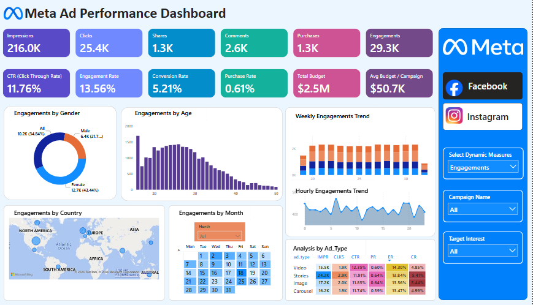
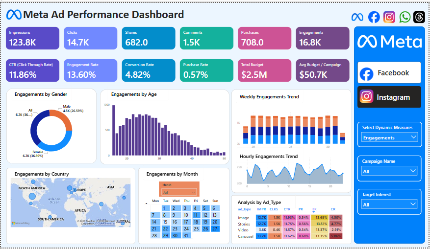
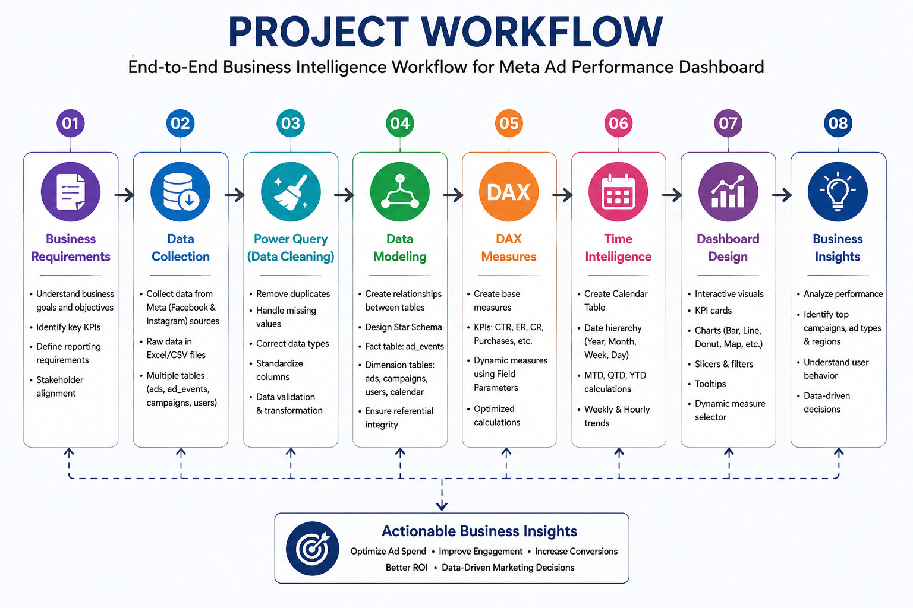
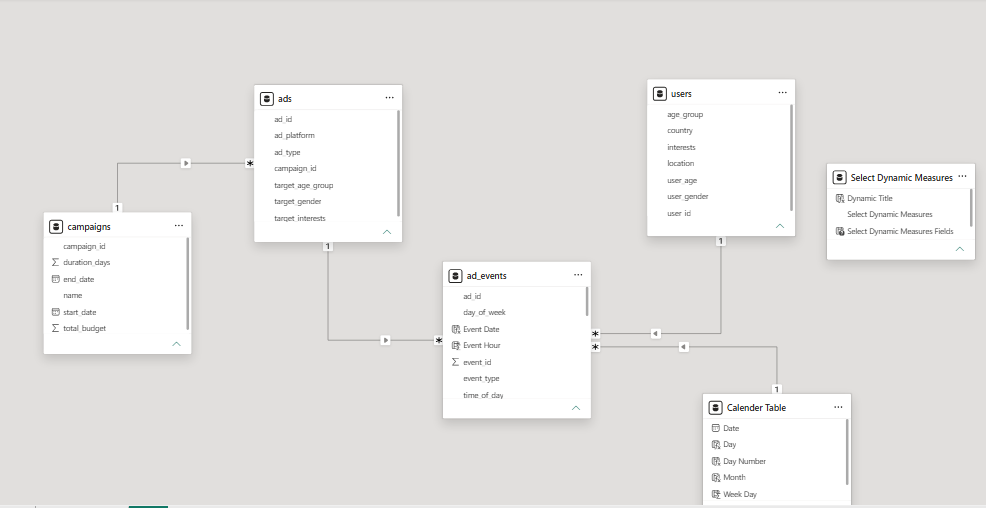
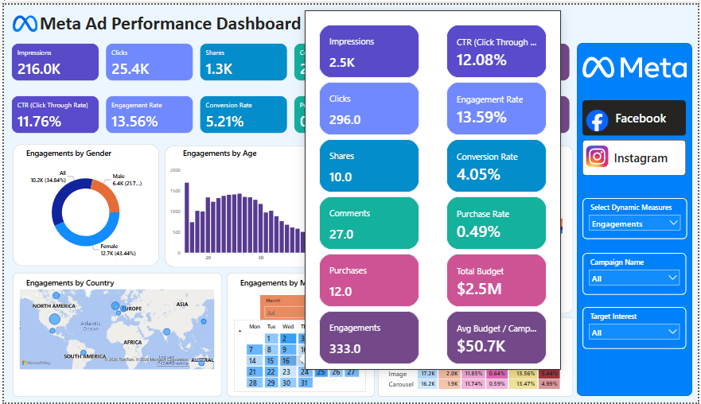

# 📊 Meta Ad Performance Dashboard
### End-to-End Business Intelligence Project using Microsoft Power BI

<p align="center">


</p>

---

# 📖 About The Project

Modern businesses invest heavily in digital advertising across platforms like **Facebook** and **Instagram**.

Every campaign generates thousands of records containing impressions, clicks, engagements, purchases, audience information, campaign details, and marketing budgets.

Although this data is valuable, raw datasets alone cannot answer important business questions.

This project demonstrates how raw marketing data can be transformed into an interactive **Business Intelligence Dashboard** using Microsoft Power BI.

The dashboard provides a complete analytical view of advertising performance by combining **Power Query**, **Data Modeling**, **DAX**, **Time Intelligence**, and **Interactive Visualizations** into one reporting solution.

---

# 🎯 Business Problem

Marketing teams need quick answers to questions such as:

- Which campaign performs the best?
- Which advertisement type generates higher engagement?
- Which customer segment is more responsive?
- Where is the marketing budget being utilized?
- How does campaign performance change over time?
- Which regions produce the highest engagement?

Without an interactive BI solution, answering these questions requires manual analysis across multiple datasets.

This dashboard solves that problem by presenting meaningful insights through interactive reports.

---

# 🚀 Solution

The solution follows the complete Business Intelligence development lifecycle.

✔ Business Requirement Analysis

✔ Data Cleaning using Power Query

✔ Data Modeling (Star Schema)

✔ DAX Measure Development

✔ Time Intelligence

✔ Interactive Dashboard Design

✔ Business Insights Generation

---

# 📷 Dashboard Preview

## Dashboard Overview



---

## Interactive Dashboard (Filtered View)



---

# ✨ Key Features

## Business Intelligence

- End-to-End BI Workflow
- Marketing Performance Analysis
- Executive KPI Dashboard
- Interactive Reporting

## Data Preparation

- Data Cleaning
- Power Query Transformations
- Data Validation
- Optimized Data Structure

## Data Modeling

- Star Schema Design
- Fact & Dimension Tables
- Relationship Modeling
- Calendar Table
- Field Parameters

## Advanced Analytics

- DAX Measures
- Time Intelligence
- Dynamic KPI Selection
- Marketing KPI Analysis

## Dashboard Development

- KPI Cards
- Dynamic Measure Selector
- Interactive Tooltips
- Geographic Analysis
- Demographic Analysis
- Weekly Trend Analysis
- Hourly Trend Analysis
- Campaign Performance Analysis

---

# 🛠 Technology Stack

| Category | Technology |
|-----------|------------|
| Business Intelligence | Microsoft Power BI |
| Data Preparation | Power Query |
| Data Modeling | Star Schema |
| Analytics | DAX |
| Time Intelligence | Calendar Table |
| Dataset | Excel / CSV |
| Visualization | KPI Cards, Charts, Maps, Slicers & Tooltips |

---

# 📊 Key Performance Indicators (KPIs)

The dashboard tracks the following business metrics:

- Impressions
- Clicks
- Shares
- Comments
- Purchases
- Engagements
- Click Through Rate (CTR)
- Engagement Rate
- Conversion Rate
- Purchase Rate
- Total Budget
- Average Budget per Campaign

---

> 💡 **This project demonstrates practical Business Intelligence skills by transforming raw advertising data into an interactive analytical dashboard using Microsoft's modern BI ecosystem.**
>
> ---

# 🔄 Project Workflow

The dashboard was developed following a complete **Business Intelligence Development Lifecycle**, starting from business requirement analysis to delivering actionable insights through an interactive dashboard.



The workflow followed in this project:

```text
Business Requirements
        ↓
Data Collection
        ↓
Data Cleaning (Power Query)
        ↓
Data Modeling (Star Schema)
        ↓
DAX Measure Development
        ↓
Time Intelligence
        ↓
Interactive Dashboard Design
        ↓
Business Insights
```

---

# 📂 Dataset Overview

The project uses multiple datasets representing different aspects of Meta advertising performance.

| Table | Description |
|--------|-------------|
| **ads** | Advertisement information such as platform, ad type, campaign ID and target audience |
| **ad_events** | Event-level records including impressions, clicks, engagements and purchases |
| **campaigns** | Campaign details such as budget, duration, start date and end date |
| **users** | User demographics including age, gender, location and interests |
| **Calendar Table** | Custom date table created for Time Intelligence |
| **Dynamic Measure Table** | Field Parameter table used for KPI switching |

---

# 🧹 Data Cleaning & Transformation

Before building the dashboard, the raw datasets were transformed using **Power Query Editor** to improve data quality and reporting accuracy.

### Data Preparation Steps

- Removed duplicate records
- Handled missing values
- Corrected data types
- Renamed columns for consistency
- Standardized categorical values
- Validated data integrity
- Optimized tables for reporting
- Prepared clean datasets for data modeling

These transformations ensure accurate calculations, efficient relationships, and reliable business insights.

---

# 🏗 Data Modeling

The project follows a **Star Schema** approach, which is considered one of the best practices in Business Intelligence for performance and scalability.

## Data Model



### Model Structure

### Fact Table

- **ad_events**

### Dimension Tables

- ads
- campaigns
- users
- Calendar Table

### Supporting Table

- Dynamic Measure Selector (Field Parameters)

### Data Modeling Highlights

- Star Schema Design
- One-to-Many Relationships
- Optimized Relationship Model
- Calendar Table Integration
- Scalable Architecture
- Performance-Oriented Design

---

# ⚡ DAX Measures

The dashboard uses DAX (Data Analysis Expressions) to create reusable business calculations and marketing KPIs.

### KPI Measures

- Total Impressions
- Total Clicks
- Total Shares
- Total Comments
- Total Purchases
- Total Engagements

### Performance Metrics

- Click Through Rate (CTR)
- Engagement Rate
- Conversion Rate
- Purchase Rate
- Total Budget
- Average Budget per Campaign

### Dynamic Measure Selection

Field Parameters have been implemented to allow users to dynamically switch between different KPIs without creating multiple visuals.

This improves dashboard usability while maintaining a clean and scalable report design.

---

# 📅 Time Intelligence

A dedicated **Calendar Table** has been created to perform time-based analysis and trend reporting.

### Implemented Features

- Custom Calendar Table
- Monthly Analysis
- Weekly Trend Analysis
- Hourly Trend Analysis
- Date Hierarchy
- Calendar Slicer
- Time-Based Filtering

Time Intelligence enables users to identify trends, compare performance across different periods, and support data-driven decision-making.

---

# 🎛 Interactive Dashboard Features

The dashboard includes several interactive features to enhance user experience and analytical capabilities.

### Dashboard Capabilities

- Executive KPI Cards
- Dynamic Measure Selector
- Interactive Tooltips
- Campaign Filters
- Target Interest Filters
- Geographic Map Visualization
- Demographic Analysis
- Weekly & Hourly Trend Analysis
- Cross Filtering
- Responsive Dashboard Layout

## Tooltip Preview



The tooltip page provides additional KPI details on hover, enabling users to explore deeper insights without overcrowding the main dashboard.

---

---

# 📈 Dashboard Insights

The dashboard transforms raw advertising data into meaningful business insights that help marketing teams evaluate campaign performance, optimize advertising spend, and improve decision-making.

## Marketing Performance Analysis

- Compare campaign performance across Facebook and Instagram.
- Monitor advertising KPIs using interactive filters.
- Identify high-performing campaigns.
- Track campaign budget utilization.

---

## Audience Insights

- Analyze engagement by gender.
- Identify the most active age groups.
- Explore engagement by country.
- Understand audience interests for better campaign targeting.

---

## Advertisement Insights

Compare the performance of different advertisement formats:

- Image Ads
- Video Ads
- Stories
- Carousel Ads

The dashboard allows users to evaluate:

- Click Through Rate (CTR)
- Engagement Rate
- Conversion Rate
- Purchase Rate

to determine the most effective advertising strategy.

---

## Time-Based Insights

The dashboard enables users to analyze performance across multiple time dimensions.

- Monthly Performance
- Weekly Engagement Trends
- Hourly Engagement Trends
- Calendar-Based Analysis

This helps identify seasonal patterns and peak engagement periods.

---

# 📸 Dashboard Gallery

## Dashboard Overview


---

## Interactive Dashboard


---

## Data Model


---

## Tooltip Preview


---

# 📁 Repository Structure

```text
Meta-Ad-Performance-Dashboard-PowerBI
│
├── Business_Requirements
├── Dashboard
├── Dashboard_Insights
├── Dataset
├── Domain_Knowledge
├── Images
└── README.md
```

---

# 💼 Skills Demonstrated

This project demonstrates practical Business Intelligence skills including:

### Business Intelligence

- Business Requirement Analysis
- KPI Development
- Interactive Reporting
- Marketing Analytics

### Data Preparation

- Data Cleaning
- Data Transformation
- Power Query
- Data Validation

### Data Modeling

- Star Schema
- Fact & Dimension Tables
- Relationship Modeling
- Calendar Table

### DAX Development

- Calculated Measures
- KPI Calculations
- Dynamic Measure Selection
- Time Intelligence

### Dashboard Design

- KPI Cards
- Interactive Slicers
- Tooltips
- Maps
- Trend Analysis
- Cross Filtering
- Responsive Dashboard Design

---

# 🚀 Future Enhancements

The dashboard can be further enhanced by implementing:

- SQL Server Integration
- Power BI Service Deployment
- Incremental Refresh
- Row Level Security (RLS)
- Azure Data Factory Integration
- Real-Time Data Streaming
- Automated Dataset Refresh
- Mobile Dashboard Optimization

---

# 🎯 Learning Outcomes

Through this project, I strengthened my understanding of:

- End-to-End Business Intelligence Workflow
- Power Query Data Transformation
- Data Modeling Best Practices
- Star Schema Design
- DAX Measure Development
- Time Intelligence
- Interactive Dashboard Design
- Marketing Analytics
- Data Visualization Principles

---

# 👨‍💻 About Me

Hi, I'm **Saif Anwar**, an aspiring **Power BI Developer** and **Business Intelligence Enthusiast**.

I enjoy building end-to-end BI solutions that transform raw data into meaningful insights using:

- Microsoft Power BI
- Power Query
- DAX
- Data Modeling
- Business Intelligence
- Data Analytics

I am continuously improving my skills by developing real-world portfolio projects focused on solving business problems through data.

---

# 🤝 Connect With Me

If you have feedback, suggestions, or would like to connect, feel free to reach out through my GitHub or LinkedIn profile.

If you found this project useful, consider giving it a ⭐ on GitHub.

---

> **"Turning raw data into actionable business insights through Business Intelligence."**
